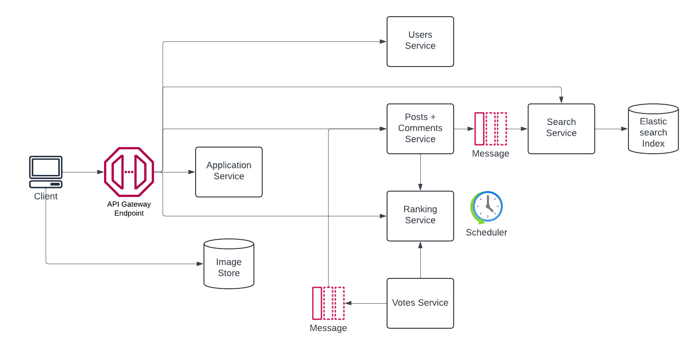

# Scribble System Design

## Table of Contents
1. [Introduction](#introduction)
2. [Requirements](#requirements)
3. [Architecture](#architecture)
4. [Component Design](#component-design)
5. [Data Model](#data-model)
6. [API Design](#api-design)
7. [Security](#security)
8. [Scalability](#scalability)
9. [Conclusion](#conclusion)

## Introduction
Scribble is a public discussion forum to allow participants to scribble and converse about their thoughts. The forum must allow users to ask questions and share information, and engage in conversations about them through comments and voting. 

This document outlines the concrete requirements of the system and the architecture to achieve them. 

## Requirements
### Functional Requirements
1. Users must be able to login or sign up. 
2. Users must have accounts to post, comment and vote.
3. Users must be able to create, edit and delete their own posts. 
4. Users must be able to create, edit, and delete comments on any post. 
5. Comments on a post must appear as a flat list in chronological order.
6. Users must be able to upvote/downvote any post or comment.
7. Users with or without accounts must see a list of the top posts on their homepage. 
8. Users must be able to search for posts and comments.

### Non-Functional Requirements
1. The system must be scalable to millions of users.
2. The system must ensure a response time of less than 500 ms for 99% of user queries of all types.
3. The system must maintain 99.9% uptime.
4. All user posts, comments and votes must be durable. 

## Architecture
The system will be built using a microservices architecture pattern where each service is independently deployable and scalable. At a high level it will have the following components:
1. **API Gateway**: Acts a single entry point for all clients, handle request routing, authentication, and rate limiting.
2. **Application Service**: Manages the front end interaction with the client by serving all web pages. 
3. **Image Store**: Clients directly upload images for posts and comments into the Image Store. The Application Service provides signed URLs to the Image Store for uploads. 
4. **User Service**: Manages user login, signup and token generation. 
5. **Post + Comment Service**: Manages creation, editing, deletion and retrieval of posts and comments.
6. **Vote Service**: Handles upvoting and dowvoting of posts and comments, ensuring each user's vote counts only once.
7. **Ranking Service**: Generates and serves the list of the top posts for the homepage measured as the total upvotes - downvotes in the last 24 hours. 
8. **Search Service**: Provides search functionality for posts and comments. 

### Architecture Diagram


## Component Design

### API Gateway
Acts a single entry point for all interactions with the system. It will route requests to respective services, ensure the user is authenticated for the operations they are trying to perform, and protect our system by rate limiting requests. It will cache responses for frequently received requests to improve performance.

### Application Service
Manages client interaction with the web application that runs in the browser. In addition to serving the web pages, it provides the client with signed URLs to upload image data. 

### Image Store
A simple object store that takes requests directly from clients for image uploads. On request, the Application Service provides the client with 1 or more signed URLs to upload images and the URLs are associated with the corresponding post or comment. On retrieval, the client receives the image URLs from the Application Service and makes direct calls to the Image Store to retrieve the images. 

### User Service
Managers user login, signup, token generation and user account details. User data will be stored in a replicated relational database. 

### Post + Comment Service
Manages creation, editing, deletion and retrieval of posts and comments. The content and lifecycle of posts and comments are similar and hence we will keep them together in the same service. Posts and comments will be stored in the same database but in independent collections. Given the requirement to scale to millions of users there will be tens of millions of posts and comments. Therefore, the posts and comments will be distributed across database shards. Posts will be sharded based on the post-id ensuring even distribution across shards. Comments will be sharded on a composite index of post-id and comment-id with range-based sharding.

### Vote Service
Handles upvoting and dowvoting of posts and comments, ensuring each users' vote counts only once. It does so by mainting a user's vote state for a specific post or comment. If the same vote is re-submitted by the user, the previous vote state is maintained and the new vote is ignored. 

Since consolidating the number of upvotes and downvotes in real-time on user request will slow down the response, a precomputed value of the upvotes and downvotes will be populated for every post and comment. To achieve this, we implement a message broker between the vote service and the post + comment service. For every vote change (this includes new votes) a message is sent over the topic. The posts + comments service processes that message and updates the upvote and downvote counts for the relevant post/comment.

### Ranking Service
The ranking service pre-computes the ranking of the top posts in the last 24 hours every 10 mins via a scheduled job. Every 10 mins, it retrieves all the votes in the last 24 hours and ranks the posts by the total upvotes - downvotes. It stores and returns this list of ordered posts on request. 

### Search Service
We will use Elasticsearch to enable search queries against posts and comments. In order to feed the Elasticsearch index, we will setup a message broker between the posts + comments service and the search service. For every create, update or delete of a post or comment an event will be sent over the message broker. The event is processed and indexed in Elasticsearch.

On searching, an Elasticsearch query is executed and relevant results are returned to the client. 

## API Design
The system can quite easily be represented by resources and operations on those resources. Therefore, we will go with a resource-based design and implement RESTful APIs.

### Resources
There are 5 resources to work with: users, posts, images, comments and votes. Users and posts are independent collections since users can exist independent of posts. Comments are a sub-collection of a post resource since comments can only be associated with a post and can't exist independently. Similarly images are also a sub-collection of a post. Vote can be a sub-resource of both a post or a comment. 

### URIs
Given the above structure we have the following URIs.

```markdown
/users
/users/{userId}

/posts
/posts{postId}

/posts/{postId}/comments
/posts/{postId}/comments/{commentId}

/posts/{postId}/images
/posts/{postId}/images/{imageId}

/posts/{postId}/vote
/posts/{postId}/comments/{commentId}/vote
```

### Resource Representation
```javascript
/users/{userId}
{
  id: "x20s"
  username: "madhavm",
  email: "madhavmurthy93@gmail.com",
  firstName: "Madhav",
  lastName: "Murthy",
  passwordHash: "sdflj2424dsdsd24",
  createdAt: "timestampz"
  updatedAt: "timestampz"
}

/posts/{postId}
{
  id: "129dl",
  userId: "x20s",
  title: "The world is flat.",
  body: "A very long explanation.",
  images: ["/images/iriod", "/images/3384ms"]
  topics: ["flat", "world" ],
  upvotes: 10,
  downvotes: 2,
  createdAt: "timestampz"
  updatedAt: "timestampz"
}

/posts/{postId}/comments/{commentId}
{
  id: "3kdo3",
  userId: "39x9",
  postId: "129dl",
  body: "A very boring comment",
  upvotes: 2,
  downvotes: 5,
  createdAt: "timestampz"
  updatedAt: "timestampz"
}
```

### Methods
The following methods can be applied. 

```markdown
// Signup
POST /users

// Login
POST /users/{userId}

// Create post
POST /posts

// Edit post
PATCH /posts/{postId}

// Delete post
DELETE /posts/{postId}

// Get posts
GET /posts

// Get post
GET /posts/{postId}

// Create comment
POST /posts/{postId}/comments

// Edit comment
PATCH /posts/{postId}/comments/{commentId}

// Delete comment
DELETE /posts/{postId}/comments/{commentId}

// Get comments
GET /posts/{postId}/comments

// Get comment
GET /posts/{postId}/comments/{commentId}

// Upload image
POST /posts/{postId}/images

// Delete image
DELETE /posts/{postId}/images/{imageId}

// Get images metadata
GET /posts/{postId}/images

// Get image metadata
GET /posts/{postId}/images/{imageId}

// Get image
Public URLs

// Vote 
POST /posts/{postId}/vote

// Vote comment
POST /posts/{postId}/comments/{commentId}/vote

```

## Data Model
We will use a mix of relational and noSQL databases. Relational databases for simple structures and noSQL databases for more complicated documents. 

### Users
For the users table we use a relational structure. 
```sql
CREATE TABLE Users (
  id VARCHAR PRIMARY KEY,
  username VARCHAR UNIQUE NOT NULL,
  email VARCHAR UNIQUE NOT NULL,
  firstName VARCHAR NOT NULL,
  lastName VARCHAR NOT NULL,
  passwordHash VARCHAR NOT NULL,
  createdAt TIMESTAMP NOT NULL,
  updatedAt TIMESTAMP NOT NULL
);
```

### Posts
For posts and comments we use a noSQL approach since we want to keep the document structure open-ended. 
```javascript
{
  id: String,
  userId: String,
  title: String,
  body: String,
  images: Array of Strings,
  topics: Array of Strings,
  upvotes: Integer,
  downvotes: Integer,
  createdAt: Timstamp,
  updatedAt: Timestamp
}
```

### Comments
```javascript
{
  id: String,
  userId: String,
  postId: String,
  body: String,
  upvotes: Integer,
  downvotes: Integer,
  createdAt: Timestamp,
  updatedAt: Timestamp
}
```

### Votes
```javascript
(
  id: String,
  userId: String,
  commentId: String,
  vote: Integer,
  createdAt: Timestamp,
  updatedAt: Timestamp
)
```

### Images
```javascript
{
  id: String,
  postId: String,
  url: String,
  createdAt: Timestamp
}
```

## Security
To ensure the security of the system, the following measures will be implemented:
1. **Authentication and Authorization**: Use JWT tokens for user authentication.
2. **Input Validation**: Validate all user inputs to prevent SQL injection, XSS, and other injection attacks.
3. **Rate Limiting**: Implement rate limiting at the API Gateway to prevent abuse and DDoS attacks.
4. **Audit Logging**: Maintain audit logs for critical actions to detect and respond to security incidents.

## Scalability
To handle increased load, the system will employ the following scalability strategies:
1. **Horizontal Scaling**: Scale out services by adding more instances behind a load balancer. 
2. **Database Sharding**: Distribute database load by sharding data across multiple database instances. This will specifically be used for the posts + comments service.
3. **Caching**: Use caching mechanisms like Redis or Memcached at the API gateway layer to improve response times and reduce load. 
4. **Asynchronous Processing**: Use message queues for tasks that can have eventual consistency which are updating the votes of posts and comments, and updating the search index. 
5. **Auto-scaling**: Implement auto-scaling policies to automatically adjust the number of running instances based on traffic patterns.

## Conclusion
As a concluding thought, the name "Scribble" was inspired by the random doodles and notes we often make when brainstorming ideas. Keep scribbling!